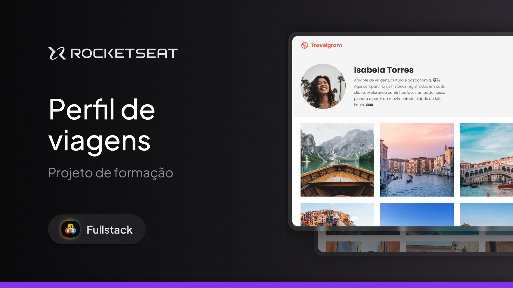

# Projeto – Perfil de Viagens (Travelgram)

Protótipo de uma interface de **perfil de viagens** desenvolvido para praticar layout responsivo, organização visual em grid e criação de interfaces inspiradas em redes sociais voltadas para fotografia e experiências de viagem.

## 📸 Pré-visualização


> 💡 Imagem ilustrativa do protótipo exibindo o perfil do usuário e a galeria de fotos.

## 🛠 Tecnologias utilizadas
- HTML5
- CSS3
- Layout com Grid e Flexbox
- Design responsivo (desktop e mobile)

## 🎞 Características do projeto
- Página de perfil com informações do usuário
- Galeria de fotos organizada em grid
- Layout limpo e focado em conteúdo visual
- Interface inspirada em plataformas de compartilhamento de viagens
- Estrutura preparada para expansão futura

## ▶️ Como visualizar o projeto
1. Baixe ou clone este repositório  
   ```bash
   git clone https://github.com/seu-usuario/nome-do-repositorio.git
   ```
2. Abra o arquivo `index.html` no navegador

## 📚 Aprendizados
- Organização de layouts utilizando CSS Grid
- Alinhamento e distribuição de elementos com Flexbox
- Criação de interfaces focadas em experiência visual
- Estruturação de páginas de perfil
- Boas práticas de responsividade

## 🚀 Próximos passos
- Implementar interações com JavaScript
- Adicionar carregamento dinâmico de imagens
- Criar versão com dados simulados (JSON)
- Implementar animações sutis de transição
- Melhorar acessibilidade da interface
